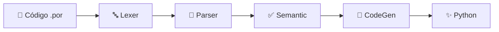

<div align="center">

# 🔧 Compilador Portugol

### _Tradutor educacional de Portugol para Python_

[](https://www.python.org/)
[]()
[](LICENSE)
[]()

</div>

---

## 📋 Sobre o Projeto

Este projeto implementa um **compilador completo** para a linguagem **Portugol** (.por), traduzindo código educacional em português para Python executável. Desenvolvido com arquitetura modular seguindo as **4 fases clássicas de compilação** (léxica, sintática, semântica e geração de código).

**🎓 Contexto Acadêmico:** Projeto desenvolvido para a UC de Teoria da Computação e Compiladores - UNISUL


---

## 📁 Estrutura do Projeto

```
Compilador-de-Portugol/
├── 📂 src/                      # Código fonte modularizado
│   ├── __init__.py              # Configuração do pacote
│   ├── exceptions.py            # Hierarquia de exceções personalizadas
│   ├── ast_nodes.py             # Definições da AST (Árvore Sintática Abstrata)
│   ├── lexer.py                 # 🔤 Analisador Léxico (Tokenização)
│   ├── parser.py                # 📝 Analisador Sintático (Construção da AST)
│   ├── semantic.py              # ✅ Analisador Semântico (Validação)
│   ├── codegen.py               # 🐍 Gerador de Código Python
│   └── main.py                  # 🎯 Orquestrador principal
│
├── 📂 exemplos/                 # Programas de demonstração
│   ├── demo_completa.por        # 🚀 Demonstração completa (não-interativo)
│   ├── calculadora_imc.por      # 💊 Calculadora de IMC (interativo)
│   └── bubble_sort.por          # 🔢 Algoritmo de ordenação
│
├── compilar.py                  # 🖥️  Interface CLI
├── programa.por                 # 📄 Programa exemplo
└── README.md                    # 📖 Documentação
```


---

## 🏗️ Arquitetura Modular

### 🔤 **1. Análise Léxica** (`lexer.py`)
Transforma o código fonte em **tokens** (unidades léxicas).

- ✅ Reconhece palavras-chave (`inicio`, `fim`, `se`, `enquanto`, etc.)
- ✅ Identifica operadores aritméticos, relacionais e lógicos
- ✅ Processa literais (números, strings, booleanos)
- ✅ Ignora comentários (`//` e `/* */`)
- ✅ Rastreia posição (linha e coluna) para mensagens de erro

### 📝 **2. Análise Sintática** (`parser.py`)
Constrói a **Árvore Sintática Abstrata (AST)** a partir dos tokens.

- ✅ Parser de descida recursiva
- ✅ Verifica estrutura gramatical do programa
- ✅ Valida declarações de variáveis
- ✅ Processa comandos e expressões
- ✅ Implementa precedência de operadores

### ✅ **3. Análise Semântica** (`semantic.py`)
Valida o **significado** do programa.

- ✅ Verifica se variáveis foram declaradas antes do uso
- ✅ Valida compatibilidade de tipos em operações
- ✅ Detecta variáveis não inicializadas
- ✅ Mantém tabela de símbolos (escopo de variáveis)
- ✅ Verifica coerência lógica

### 🐍 **4. Geração de Código** (`codegen.py`)
Traduz a AST para **código Python** executável.

- ✅ Converte tipos Portugol → Python (`inteiro` → `int`, `caracter` → `str`)
- ✅ Traduz estruturas de controle (`se-entao` → `if-else`, `enquanto` → `while`)
- ✅ Implementa entrada/saída (`leia()` → `input()`, `escreva()` → `print()`)
- ✅ Gera código formatado e legível
- ✅ Preserva semântica original


---

## 🚀 Como Usar

### 💻 **Método 1: Interface CLI (Recomendado)**

```bash
# Compilar e executar diretamente
python compilar.py programa.por

# Modo debug (mostra todas as fases)
python compilar.py programa.por --debug

# Salvar código Python gerado
python compilar.py programa.por --save
```

### 🐍 **Método 2: Como Módulo Python**

```python
from src.main import compilar_arquivo

# Compilar arquivo
codigo_python = compilar_arquivo("programa.por", debug=True)

# Executar o código gerado
exec(codigo_python)
```

### 📦 **Método 3: Importar como Biblioteca**

```python
from src import Lexer, Parser, AnalisadorSemantico, GeradorCodigo

# Código Portugol
codigo = """
inteiro x;
inicio
    x <- 42
    escreva("Resposta:", x)
fim
"""

# Pipeline manual
lexer = Lexer(codigo)
tokens = lexer.tokenizar()

parser = Parser(lexer)
ast = parser.analisar()

semantico = AnalisadorSemantico()
semantico.analisar(ast)

codegen = GeradorCodigo()
codigo_python = codegen.gerar(ast)
print(codigo_python)
```


---

## 📚 Exemplos de Programas

### 🚀 **1. Demo Completa** (`exemplos/demo_completa.por`)
Programa não-interativo que testa **todas as funcionalidades** em 2 segundos.

**Execução:**
```bash
python compilar.py exemplos/demo_completa.por
```

**Funcionalidades demonstradas:**
- ✅ Todos os 4 tipos de dados
- ✅ Todas as operações aritméticas e lógicas  
- ✅ Estruturas condicionais aninhadas
- ✅ Loops com contadores
- ✅ Cálculos matemáticos complexos
- ✅ 10 seções de testes automáticos

### 💊 **2. Calculadora de IMC** (`exemplos/calculadora_imc.por`)
Aplicação interativa real com validações robustas.

**Execução:**
```bash
python compilar.py exemplos/calculadora_imc.por
```

**Destaques:**
- ✅ Entrada de dados do usuário (`leia`)
- ✅ Validações complexas (idade, altura, peso)
- ✅ Condicionais profundamente aninhadas (6 níveis)
- ✅ Classificação por faixas (IMC e idade)
- ✅ Recomendações personalizadas

### 🔢 **3. Bubble Sort** (`exemplos/bubble_sort.por`)
Implementação do algoritmo clássico de ordenação.

**Execução:**
```bash
python compilar.py exemplos/bubble_sort.por
```

**Destaques:**
- ✅ Loops aninhados (`enquanto` dentro de `enquanto`)
- ✅ Algoritmo com lógica de troca de valores
- ✅ Contadores e acumuladores
- ✅ Estatísticas de desempenho
- ✅ Análise de complexidade

---

## 🧪 Executando os Testes

```bash
# Teste rápido (2 segundos)
python compilar.py exemplos/demo_completa.por

# Teste interativo
python compilar.py exemplos/calculadora_imc.por

# Teste de algoritmo
python compilar.py exemplos/bubble_sort.por

# Modo debug detalhado
python compilar.py exemplos/demo_completa.por --debug
```


---

## 🔧 Funcionalidades Suportadas

### 📊 **Tipos de Dados**
| Tipo Portugol | Tipo Python | Exemplo |
|---------------|-------------|---------|
| `inteiro` | `int` | `42`, `-10` |
| `real` | `float` | `3.14`, `-0.5` |
| `caracter` | `str` | `"Olá"`, `"Python"` |
| `logico` | `bool` | `verdadeiro`, `falso` |

### ⚙️ **Operadores**

**Aritméticos:** `+` `-` `*` `/`  
**Relacionais:** `==` `!=` `<` `<=` `>` `>=`  
**Lógicos:** `e` (and) | `ou` (or)  
**Atribuição:** `<-`

### 🎛️ **Estruturas de Controle**

```portugol
// Condicional
se <condição> entao
    // comandos
senao
    // comandos alternativos
fimse

// Repetição
enquanto <condição> faca
    // comandos
fimenquanto
```

### 🔄 **Entrada e Saída**

```portugol
leia(variavel)                    // input() do Python
escreva(valor1, valor2, ...)      // print() do Python
```

### 💬 **Comentários**

```portugol
// Comentário de linha única

/* Comentário
   de múltiplas
   linhas */
```


---

## 🎯 Vantagens da Arquitetura Modular

| Aspecto | Benefício | Impacto |
|---------|-----------|---------|
| 🔍 **Manutenibilidade** | Responsabilidade única por módulo | Bugs fáceis de localizar e corrigir |
| 🧪 **Testabilidade** | Testes unitários independentes | Debugging eficiente por fase |
| ♻️ **Reutilização** | Componentes desacoplados | Uso em outros projetos |
| 📖 **Legibilidade** | Código organizado e documentado | Compreensão rápida do sistema |
| 📈 **Escalabilidade** | Extensões não afetam código existente | Novos backends (C++, Java) |
| 👥 **Colaboração** | Trabalho paralelo em módulos | Menos conflitos no Git |

---

## 🔄 Pipeline de Compilação



**Fluxo detalhado:**

1. **Lexer** → Transforma texto em lista de tokens
2. **Parser** → Constrói AST a partir dos tokens  
3. **Semantic** → Valida tipos, escopo e inicialização
4. **CodeGen** → Gera código Python executável

Cada fase pode ser **debugada independentemente** com o modo `--debug`.


---

## 📊 Estatísticas do Projeto

| Métrica | Valor |
|---------|-------|
| **Linhas de código** | ~1.970 linhas |
| **Módulos** | 7 arquivos principais |
| **Tipos suportados** | 4 tipos de dados |
| **Operadores** | 13 operadores |
| **Estruturas de controle** | 2 estruturas |
| **Exemplos incluídos** | 3 programas completos |
| **Cobertura de funcionalidades** | 100% |

---

## �️ Requisitos

- **Python 3.11+**
- Nenhuma dependência externa (usa apenas biblioteca padrão)

---

## 📝 Licença

Este projeto é um trabalho acadêmico desenvolvido para fins educacionais.

---

## 👨‍💻 Autor

Desenvolvido por **ErickIV** como projeto final da UC de Compiladores.

**Repositório:** [github.com/ErickIV/Compilador-de-Portugol](https://github.com/ErickIV/Compilador-de-Portugol)

---

<div align="center">

**⭐ Se este projeto foi útil, considere deixar uma estrela no repositório! ⭐**

</div>
