<div align="center">

# 🔧 Compilador Portugol

### _Tradutor educacional de Portugol para Python_

[](https://www.python.org/)
[]()
[](LICENSE)
[]()

</div>

---

## 📋 Sobre o Projeto

Este projeto implementa um **compilador completo** para a linguagem **Portugol** (.por), traduzindo código educacional em português para Python executável. Desenvolvido com arquitetura modular seguindo as **6 fases clássicas de compilação**, incluindo geração de código intermediário e otimizações.

**🎓 Contexto Acadêmico:** Projeto desenvolvido para a UC de Teoria da Computação e Compiladores - UNISUL

### ✨ **Novidades - Versão 2.0**

🚀 **Fases Completas de Compilação:**
- ✅ Análise Léxica com Expressões Regulares documentadas
- ✅ Autômatos Finitos Determinísticos (AFD) explícitos
- ✅ Geração de Código Intermediário (3 endereços)
- ✅ 5 tipos de Otimizações implementadas
- ✅ Comparação de código antes/depois das otimizações


---

## 📁 Estrutura do Projeto

```
Compilador-de-Portugol/
├── 📂 src/                      # Código fonte modularizado
│   ├── __init__.py              # Configuração do pacote
│   ├── exceptions.py            # Hierarquia de exceções personalizadas
│   ├── ast_nodes.py             # Definições da AST (Árvore Sintática Abstrata)
│   ├── lexer.py                 # 🔤 Analisador Léxico (Tokenização + ERs)
│   ├── automaton.py             # 🤖 Autômatos Finitos Determinísticos (AFD)
│   ├── parser.py                # 📝 Analisador Sintático (Construção da AST)
│   ├── semantic.py              # ✅ Analisador Semântico (Validação)
│   ├── intermediate.py          # 🔄 Gerador de Código Intermediário (3 endereços)
│   ├── optimizer.py             # ⚡ Otimizador de Código
│   ├── codegen.py               # 🐍 Gerador de Código Python
│   └── main.py                  # 🎯 Orquestrador principal
│
├── 📂 exemplos/                 # Programas de demonstração
│   ├── demo_completa.por        # 🚀 Demonstração completa (não-interativo)
│   ├── calculadora_imc.por      # 💊 Calculadora de IMC (interativo) [BUG CORRIGIDO]
│   ├── bubble_sort.por          # 🔢 Algoritmo de ordenação
│   ├── teste_otimizacoes.por    # ⚡ Teste de otimizações
│   ├── fibonacci.por            # 🔁 Sequência de Fibonacci (loop 'para') [NOVO]
│   ├── fatorial.por             # 🧮 Fatorial e potenciação (^) [NOVO]
│   └── teste_modulo.por         # ➗ Operador módulo (%) e paridade [NOVO]
│
├── compilar.py                  # 🖥️  Interface CLI
├── programa.por                 # 📄 Programa exemplo
└── README.md                    # 📖 Documentação
```


---

## 🏗️ Arquitetura Modular

### 🔤 **1. Análise Léxica** (`lexer.py` + `automaton.py`)
Transforma o código fonte em **tokens** (unidades léxicas).

- ✅ Reconhece palavras-chave (`inicio`, `fim`, `se`, `enquanto`, etc.)
- ✅ Identifica operadores aritméticos, relacionais e lógicos
- ✅ Processa literais (números, strings, booleanos)
- ✅ Ignora comentários (`//` e `/* */`)
- ✅ Rastreia posição (linha e coluna) para mensagens de erro
- ✨ **NOVO:** Expressões Regulares documentadas para cada tipo de token
- ✨ **NOVO:** AFDs explícitos para reconhecimento educacional

### 📝 **2. Análise Sintática** (`parser.py`)
Constrói a **Árvore Sintática Abstrata (AST)** a partir dos tokens.

- ✅ Parser de descida recursiva
- ✅ Verifica estrutura gramatical do programa
- ✅ Valida declarações de variáveis
- ✅ Processa comandos e expressões
- ✅ Implementa precedência de operadores

### ✅ **3. Análise Semântica** (`semantic.py`)
Valida o **significado** do programa.

- ✅ Verifica se variáveis foram declaradas antes do uso
- ✅ Valida compatibilidade de tipos em operações
- ✅ Detecta variáveis não inicializadas
- ✅ Mantém tabela de símbolos (escopo de variáveis)
- ✅ Verifica coerência lógica

### 🔄 **4. Geração de Código Intermediário** (`intermediate.py`) [NOVO]
Gera representação de **3 endereços** para facilitar otimizações.

- ✨ Linearização da AST em instruções sequenciais
- ✨ Cada instrução tem no máximo 3 operandos
- ✨ Suporta labels e saltos condicionais
- ✨ Base para aplicação de otimizações

### ⚡ **5. Otimização** (`optimizer.py`) [NOVO]
Aplica transformações que preservam semântica mas melhoram desempenho.

- ✨ **Constant Folding:** Avalia constantes em tempo de compilação
- ✨ **Constant Propagation:** Substitui variáveis por valores conhecidos
- ✨ **Algebraic Simplification:** Aplica identidades matemáticas (x+0=x, x*1=x)
- ✨ **Copy Propagation:** Elimina cópias desnecessárias
- ✨ **Dead Code Elimination:** Remove código não utilizado

### 🐍 **6. Geração de Código Final** (`codegen.py`)
Traduz a AST para **código Python** executável.

- ✅ Converte tipos Portugol → Python (`inteiro` → `int`, `caracter` → `str`)
- ✅ Traduz estruturas de controle (`se-entao` → `if-else`, `enquanto` → `while`)
- ✅ Implementa entrada/saída (`leia()` → `input()`, `escreva()` → `print()`)
- ✅ Gera código formatado e legível
- ✅ Preserva semântica original


---

## 📥 Instalação

```bash
# Clone o repositório
git clone https://github.com/ErickIV/Compilador-de-Portugol.git
cd Compilador-de-Portugol

# Verificar versão do Python (requer 3.11+)
python --version
```

**Pronto!** O compilador usa apenas a biblioteca padrão do Python, não requer instalação de dependências.

---

## 🚀 Como Usar

### 💻 **Método 1: Interface CLI (Recomendado)**

```bash
# Compilar e executar diretamente
python compilar.py programa.por

# Modo debug (mostra todas as fases)
python compilar.py programa.por --debug

# Salvar código Python gerado
python compilar.py programa.por --save

# 🆕 Mostrar código intermediário (3 endereços)
python compilar.py programa.por --intermediate

# 🆕 Aplicar otimizações + mostrar antes/depois (requer --intermediate)
python compilar.py programa.por --intermediate --optimize

# 🆕 Demonstrar AFDs de reconhecimento de tokens
python compilar.py programa.por --show-afd

# 🆕 Modo completo (debug + intermediário + otimizações)
python compilar.py programa.por --debug --intermediate --optimize
```

### 📊 **Novas Flags Disponíveis**

| Flag | Descrição | Exemplo de Uso |
|------|-----------|----------------|
| `--intermediate` | Mostra código intermediário de 3 endereços | `python compilar.py teste.por --intermediate` |
| `--optimize` | Aplica otimizações (requer `--intermediate`) | `python compilar.py teste.por --intermediate --optimize` |
| `--show-afd` | Demonstra AFDs para tokens (educacional) | `python compilar.py teste.por --show-afd` |
| `--debug` | Mostra todas as fases detalhadamente | `python compilar.py teste.por --debug` |
| `--save` | Salva arquivo .py gerado | `python compilar.py teste.por --save` |

### 🐍 **Método 2: Como Módulo Python**

```python
from src.main import CompiladorPortugol

# Criar compilador
compilador = CompiladorPortugol(debug=True)

# Compilar e executar arquivo
sucesso = compilador.compilar_arquivo("programa.por")
```

### 📦 **Método 3: Importar como Biblioteca**

```python
from src.lexer import Lexer
from src.parser import Parser
from src.semantic import AnalisadorSemantico
from src.codegen import GeradorDeCodigo

# Código Portugol
codigo = """
inteiro x;
inicio
    x <- 42
    escreva("Resposta:", x)
fim
"""

# Pipeline manual
lexer = Lexer(codigo)

parser = Parser(lexer)
ast = parser.analisar()

semantico = AnalisadorSemantico()
semantico.analisar(ast)

codegen = GeradorDeCodigo()
codigo_python = codegen.gerar(ast)
print(codigo_python)
```


---

## 📚 Exemplos de Programas

### 🚀 **1. Demo Completa** (`exemplos/demo_completa.por`)
Programa não-interativo que testa **todas as funcionalidades** em 2 segundos.

**Execução:**
```bash
python compilar.py exemplos/demo_completa.por
```

**Funcionalidades demonstradas:**
- ✅ Todos os 4 tipos de dados
- ✅ Todas as operações aritméticas e lógicas  
- ✅ Estruturas condicionais aninhadas
- ✅ Loops com contadores
- ✅ Cálculos matemáticos complexos
- ✅ 10 seções de testes automáticos

### 💊 **2. Calculadora de IMC** (`exemplos/calculadora_imc.por`)
Aplicação interativa real com validações robustas.

**Execução:**
```bash
python compilar.py exemplos/calculadora_imc.por
```

**Destaques:**
- ✅ Entrada de dados do usuário (`leia`)
- ✅ Validações complexas (idade, altura, peso)
- ✅ Condicionais profundamente aninhadas (6 níveis)
- ✅ Classificação por faixas (IMC e idade)
- ✅ Recomendações personalizadas

### 🔢 **3. Bubble Sort** (`exemplos/bubble_sort.por`)
Implementação do algoritmo clássico de ordenação.

**Execução:**
```bash
python compilar.py exemplos/bubble_sort.por
```

**Destaques:**
- ✅ Loops aninhados (`enquanto` dentro de `enquanto`)
- ✅ Algoritmo com lógica de troca de valores
- ✅ Contadores e acumuladores
- ✅ Estatísticas de desempenho
- ✅ Análise de complexidade

### ⚡ **4. Teste de Otimizações** (`exemplos/teste_otimizacoes.por`) [NOVO]
Demonstra as 5 otimizações implementadas no compilador.

**Execução:**
```bash
python compilar.py exemplos/teste_otimizacoes.por --intermediate --optimize
```

**Otimizações demonstradas:**
- ✨ **Constant Folding:** `5 + 3` → `8` (compilado em tempo de compilação)
- ✨ **Algebraic Simplification:** `x + 0` → `x`, `x * 1` → `x`, `x * 0` → `0`
- ✨ **Constant Propagation:** `x = 5; y = x + 3` → `y = 8`
- ✨ **Dead Code Elimination:** Remove temporários não usados
- ✨ **Copy Propagation:** Elimina cópias desnecessárias

**Saída com `--optimize`:**
- Código intermediário original (antes das otimizações)
- Código intermediário otimizado (depois das otimizações)
- Relatório comparativo mostrando redução de instruções

### 🔁 **5. Fibonacci** (`exemplos/fibonacci.por`) [NOVO]
Demonstra o loop 'para' com a sequência de Fibonacci.

**Execução:**
```bash
python compilar.py exemplos/fibonacci.por
```

**Destaques:**
- ✅ Loop 'para' com passo personalizado
- ✅ Cálculo iterativo de Fibonacci
- ✅ Demonstração de acumuladores
- ✅ Operações com múltiplas variáveis

### 🧮 **6. Fatorial e Potenciação** (`exemplos/fatorial.por`) [NOVO]
Demonstra operador de potenciação e cálculo de fatorial.

**Execução:**
```bash
python compilar.py exemplos/fatorial.por
```

**Destaques:**
- ✅ Operador de potenciação (`^`)
- ✅ Cálculo de fatorial com loop 'para'
- ✅ Operações matemáticas complexas
- ✅ Múltiplos exemplos de potências

### ➗ **7. Teste de Módulo** (`exemplos/teste_modulo.por`) [NOVO]
Demonstra o operador módulo (%) e verificação de paridade.

**Execução:**
```bash
python compilar.py exemplos/teste_modulo.por
```

**Destaques:**
- ✅ Operador módulo (`%`)
- ✅ Verificação de números pares/ímpares
- ✅ Condicionais com operações matemáticas
- ✅ Demonstração prática de resto de divisão

---

## 🧪 Executando os Testes

```bash
# Teste rápido (2 segundos)
python compilar.py exemplos/demo_completa.por

# Teste interativo
python compilar.py exemplos/calculadora_imc.por

# Teste de algoritmo
python compilar.py exemplos/bubble_sort.por

# 🆕 Teste de otimizações (mostra código intermediário)
python compilar.py exemplos/teste_otimizacoes.por --intermediate --optimize

# Modo debug detalhado
python compilar.py exemplos/demo_completa.por --debug

# 🆕 Visualizar AFDs (educacional)
python compilar.py exemplos/demo_completa.por --show-afd

# 🆕 Modo professor: todas as fases visíveis
python compilar.py exemplos/teste_otimizacoes.por --debug --intermediate --optimize --show-afd
```


---

## 🔧 Funcionalidades Suportadas

### 📊 **Tipos de Dados**
| Tipo Portugol | Tipo Python | Exemplo |
|---------------|-------------|---------|
| `inteiro` | `int` | `42`, `-10` |
| `real` | `float` | `3.14`, `-0.5` |
| `caracter` | `str` | `"Olá"`, `"Python"` |
| `logico` | `bool` | `verdadeiro`, `falso` |

### ⚙️ **Operadores**

**Aritméticos:** `+` `-` `*` `/` `%` (módulo) `^` (potenciação)
**Relacionais:** `==` `!=` `<` `<=` `>` `>=`
**Lógicos:** `e` (and) | `ou` (or)
**Atribuição:** `<-`

**Exemplos:**
- `10 % 3` → `1` (resto da divisão)
- `2 ^ 8` → `256.0` (2 elevado a 8)
- `x % 2 == 0` → verifica se x é par

### 🎛️ **Estruturas de Controle**

```portugol
// Condicional
se <condição> entao
    // comandos
senao
    // comandos alternativos
fimse

// Repetição - enquanto
enquanto <condição> faca
    // comandos
fimenquanto

// Repetição - para (novo!)
para variavel de inicio ate fim passo incremento faca
    // comandos
fimpara

// Exemplo: loop de 1 a 10
para i de 1 ate 10 passo 1 faca
    escreva(i)
fimpara
```

### 🔄 **Entrada e Saída**

```portugol
leia(variavel)                    // input() do Python
escreva(valor1, valor2, ...)      // print() do Python
```

### 💬 **Comentários**

```portugol
// Comentário de linha única

/* Comentário
   de múltiplas
   linhas */
```


---

## 🎯 Vantagens da Arquitetura Modular

| Aspecto | Benefício | Impacto |
|---------|-----------|---------|
| 🔍 **Manutenibilidade** | Responsabilidade única por módulo | Bugs fáceis de localizar e corrigir |
| 🧪 **Testabilidade** | Testes unitários independentes | Debugging eficiente por fase |
| ♻️ **Reutilização** | Componentes desacoplados | Uso em outros projetos |
| 📖 **Legibilidade** | Código organizado e documentado | Compreensão rápida do sistema |
| 📈 **Escalabilidade** | Extensões não afetam código existente | Novos backends (C++, Java) |
| 👥 **Colaboração** | Trabalho paralelo em módulos | Menos conflitos no Git |

---

## 🔄 Pipeline de Compilação

```mermaid
graph LR
    A[📄 Código .por] --> B[🔤 Lexer + AFD]
    B --> C[📝 Parser]
    C --> D[✅ Semantic]
    D --> E[🔄 Intermediate]
    E --> F[⚡ Optimizer]
    F --> G[🐍 CodeGen]
    G --> H[✨ Python]
```



> **Nota:** Se o diagrama acima não for renderizado, você está visualizando em um leitor que não suporta Mermaid. Veja o repositório no GitHub para visualização completa.

**Fluxo detalhado:**

1. **Lexer** → Transforma texto em lista de tokens (usa ERs e AFDs)
2. **Parser** → Constrói AST a partir dos tokens  
3. **Semantic** → Valida tipos, escopo e inicialização
4. **Intermediate** → Gera código de 3 endereços (opcional)
5. **Optimizer** → Aplica 5 otimizações (opcional)
6. **CodeGen** → Gera código Python executável

Cada fase pode ser **debugada independentemente** com o modo `--debug`.  
Fases 4 e 5 são **opcionais** (ativadas com `--intermediate` e `--optimize`).


---

## 📐 Gramática BNF Formal

```bnf
<programa> ::= <declaracoes> "inicio" <comandos> "fim"

<declaracoes> ::= ( <declaracao> ";" )*

<declaracao> ::= <tipo> <lista_vars>

<tipo> ::= "inteiro" | "real" | "caracter" | "logico"

<lista_vars> ::= IDENTIFICADOR ( "," IDENTIFICADOR )*

<comandos> ::= ( <comando> )*

<comando> ::= <atribuicao>
            | <condicional>
            | <repeticao>
            | <repeticao_para>
            | <entrada>
            | <saida>

<atribuicao> ::= IDENTIFICADOR "<-" <expressao>

<condicional> ::= "se" <expressao> "entao" <comandos>
                 [ "senao" <comandos> ] "fimse"

<repeticao> ::= "enquanto" <expressao> "faca" <comandos> "fimenquanto"

<repeticao_para> ::= "para" IDENTIFICADOR "de" <expressao>
                     "ate" <expressao> "passo" <expressao>
                     "faca" <comandos> "fimpara"

<entrada> ::= "leia" "(" IDENTIFICADOR ")"

<saida> ::= "escreva" "(" <lista_expr> ")"

<lista_expr> ::= <expressao> ( "," <expressao> )*

<expressao> ::= <expr_ou>

<expr_ou> ::= <expr_e> ( "ou" <expr_e> )*

<expr_e> ::= <expr_relacional> ( "e" <expr_relacional> )*

<expr_relacional> ::= <expr_aritmetica>
                     [ ( "==" | "!=" | "<" | "<=" | ">" | ">=" ) <expr_aritmetica> ]

<expr_aritmetica> ::= <termo> ( ( "+" | "-" ) <termo> )*

<termo> ::= <potencia> ( ( "*" | "/" | "%" ) <potencia> )*

<potencia> ::= <fator> [ "^" <potencia> ]

<fator> ::= NUMERO_INTEIRO
          | NUMERO_REAL
          | TEXTO
          | "verdadeiro"
          | "falso"
          | IDENTIFICADOR
          | "(" <expressao> ")"
          | "-" <fator>
```

---

## ⚠️ Limitações Conhecidas

### **Limitações de Escopo Acadêmico**

Este compilador foi desenvolvido para fins educacionais. As seguintes limitações são conhecidas:

1. **Sem Suporte a Arrays/Vetores**
   - Não há suporte para estruturas de dados compostas
   - Apenas variáveis escalares são suportadas

2. **Sem Funções/Procedimentos**
   - Todo código deve estar no programa principal
   - Não há suporte para modularização via funções

3. **Escopo Global Único**
   - Todas as variáveis são globais
   - Não há blocos de escopo aninhados

4. **Loop 'para' com Passo Fixo**
   - A condição assume passo positivo (`<=`)
   - Não detecta automaticamente direção (crescente/decrescente)

5. **Tipos Estáticos Simples**
   - Sem conversão automática complexa entre tipos
   - Sem suporte a estruturas ou registros

6. **Entrada/Saída Básica**
   - `leia()` e `escreva()` são as únicas operações de I/O
   - Sem acesso a arquivos ou sockets

7. **Sem Tratamento de Exceções**
   - Erros de runtime não são capturados
   - Divisão por zero causará erro do Python

8. **Otimizações Locais**
   - Otimizações são intra-procedimentais
   - Sem análise de fluxo de dados global

### **Comportamento Específico**

- **Divisão (`/`) e Potenciação (`^`)**: Sempre retornam `real` (float)
- **Módulo (`%`)**: Pode retornar `real` se operandos forem reais
- **Comparações**: Permitem comparar tipos diferentes (conversão implícita)
- **Booleanos**: `verdadeiro` → `True`, `falso` → `False`

---

## ❓ Problemas Comuns

### **Erro: "python: command not found"**
**Solução:** Use `python3` ao invés de `python` no Linux/macOS.
```bash
python3 compilar.py programa.por
```

### **Erro: versão do Python incompatível**
**Solução:** Este compilador requer Python 3.11 ou superior. Verifique sua versão:
```bash
python --version
```
Se necessário, instale uma versão mais recente do Python.

### **Erro na execução de programas interativos**
**Solução:** Certifique-se de estar executando em um terminal interativo, não em uma IDE ou ambiente não-interativo.
```bash
# Execute diretamente no terminal/prompt de comando
python compilar.py exemplos/calculadora_imc.por
```

### **Código gerado não executa corretamente**
**Solução:** Use o modo `--debug` para ver todas as fases da compilação e identificar onde está o problema:
```bash
python compilar.py programa.por --debug
```

### **Erro de sintaxe no código Portugol**
**Solução:** Verifique:
- Se todas as variáveis foram declaradas antes do `inicio`
- Se você está usando `<-` para atribuição (não `=`)
- Se todas as estruturas têm seus fechamentos (`fimse`, `fimenquanto`, `fimpara`)
- Se há ponto-e-vírgula (`;`) após cada declaração de variável

### **Otimizações não aparecem**
**Solução:** A flag `--optimize` requer `--intermediate`:
```bash
python compilar.py programa.por --intermediate --optimize
```

---

## 📊 Estatísticas do Projeto

| Métrica | Valor |
|---------|-------|
| **Linhas de código** | ~2.500 linhas |
| **Módulos** | 10 arquivos principais |
| **Fases de compilação** | 6 fases (4 obrigatórias + 2 opcionais) |
| **Tipos suportados** | 4 tipos de dados |
| **Operadores** | 15 operadores (+, -, *, /, %, ^, ==, !=, <, <=, >, >=, e, ou, <-) |
| **Estruturas de controle** | 3 estruturas (se-entao-senao, enquanto, para) |
| **Otimizações implementadas** | 5 tipos |
| **Exemplos incluídos** | 7 programas completos |
| **Cobertura de funcionalidades** | 100% |
| **AFDs implementados** | 3 autômatos (identificador, inteiro, real) |
| **Expressões Regulares** | 11 padrões documentados |

---

## 💻 Requisitos

- **Python 3.11+**
- Nenhuma dependência externa (usa apenas biblioteca padrão)

---

## 🤝 Contribuindo

Este é um projeto acadêmico, mas contribuições são bem-vindas!

### **Como contribuir:**

1. **Fork o repositório**
   ```bash
   # Clique em "Fork" no GitHub
   ```

2. **Clone seu fork**
   ```bash
   git clone https://github.com/seu-usuario/Compilador-de-Portugol.git
   cd Compilador-de-Portugol
   ```

3. **Crie uma branch para sua feature**
   ```bash
   git checkout -b feature/nova-funcionalidade
   ```

4. **Faça suas alterações e commit**
   ```bash
   git add .
   git commit -m "Adiciona nova funcionalidade X"
   ```

5. **Push para seu fork**
   ```bash
   git push origin feature/nova-funcionalidade
   ```

6. **Abra um Pull Request**
   - Vá até o repositório original no GitHub
   - Clique em "Pull Request"
   - Descreva suas alterações detalhadamente

### **Áreas para contribuição:**

- 🐛 Correção de bugs
- ✨ Novas funcionalidades (arrays, funções, etc.)
- 📚 Melhorias na documentação
- 🧪 Adição de testes
- ⚡ Novas otimizações
- 🎨 Melhorias na geração de código
- 📝 Novos exemplos de programas

### **Diretrizes:**

- Mantenha a arquitetura modular existente
- Documente seu código adequadamente
- Teste suas alterações antes de submeter
- Siga o estilo de código do projeto

---

## 📝 Licença

Este projeto é um trabalho acadêmico desenvolvido para fins educacionais.

---

## 👨‍💻 Autor

Desenvolvido por **ErickIV** como projeto final da UC de Compiladores.

**Repositório:** [github.com/ErickIV/Compilador-de-Portugol](https://github.com/ErickIV/Compilador-de-Portugol)

---

<div align="center">

**⭐ Se este projeto foi útil, considere deixar uma estrela no repositório! ⭐**

</div>
